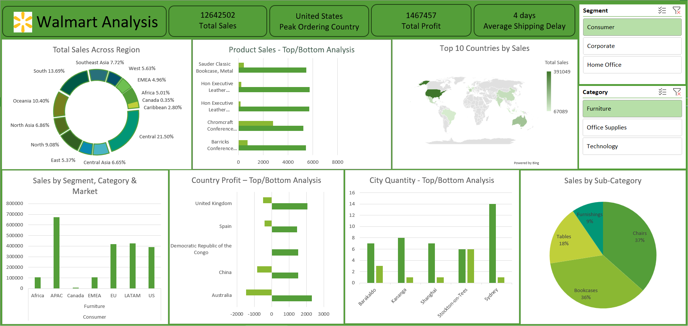

# 🛒 Walmart Global Sales Performance Dashboard

---

## 📌 Project Overview

This project presents a comprehensive analysis of Walmart’s global sales dataset through a dynamic and interactive dashboard built entirely in Microsoft Excel.

The objective is to transform raw transactional data into meaningful insights that support strategic, data-driven decision-making at a business level.

---

## 🎯 Business Objective

To design a KPI-driven dashboard that enables stakeholders to:

* Monitor overall business performance
* Analyze regional and market-level sales trends
* Identify top and bottom-performing products
* Evaluate profitability across countries
* Understand global sales distribution patterns

---

## 📊 Dashboard Capabilities

### 🔹 Key Performance Indicators (KPIs)

* **Total Sales:** 12.64M
* **Total Profit:** 1.47M
* **Average Shipping Time:** 4 Days
* **Total Orders (U.S.):** 9,994

---

### 🔹 Market & Segment Analysis

Sales performance across major markets:

* APAC: 673K
* LATAM: 425K
* EU: 419K
* US: 391K

This analysis highlights regional variations and helps identify high-performing markets.

---

### 🔹 Top & Bottom Product Performance

The dashboard identifies top and bottom-performing products based on:

* Sales
* Profit
* Order Quantity

**Top Performing Products:**

* Hon Executive Leather Armchair (Black)
* Barricks Conference Table
* Sauder Classic Bookcase

---

### 🔹 Profitability Insights by Country

* High-profit countries:

  * Australia (2316)
  * United Kingdom (2071)

* Loss-making scenarios identified:

  * Australia (-1479)
  * China (-821)

This helps uncover regions where high sales do not translate into profitability.

---

### 🔹 Quantity Distribution Analysis

Cities with highest order volumes:

* Sydney (Max: 14)
* Kananga (Max: 8)

---

### 🌍 Global Sales Distribution (Top Countries)

* United States: 391K
* Australia: 185K
* France: 130K
* China: 113K
* India: 110K

This highlights the geographical concentration of Walmart’s revenue.

---

### 📈 Market Share by Region

* Central: **21.5%**
* South: **13.69%**
* Oceania: **10.4%**

This breakdown provides a clear view of regional dominance.

---

### 🪑 Sub-Category Contribution to Sales

* Chairs: **36.57%**
* Bookcases: **35.95%**
* Tables: **17.93%**
* Furnishings: **9.55%**

This helps identify key revenue-driving product categories.

---

## 🧰 Tools & Techniques Used

* **Microsoft Excel**

  * Pivot Tables
  * Pivot Charts
  * Data Aggregation
  * KPI Design
  * Dashboard Structuring

---

## 📸 Dashboard Preview

---

## 📁 Dataset Description

* Orders: 51,291 records
* Returns: 1,174 records
* People: 14 records

---

## 🚀 Key Business Insights

* The United States is the highest revenue-generating country
* Chairs and Bookcases together contribute over **70% of total sales**
* Some regions exhibit **high sales but low profitability**, indicating inefficiencies
* The Central region dominates market share with over **20% contribution**

---

## 📌 Business Impact

This dashboard enables decision-makers to quickly identify revenue drivers, monitor profitability trends, and uncover underperforming regions—supporting more informed and strategic business decisions.

---

## 🔗 Project Access

* 📂 GitHub Repository:
  https://github.com/JevaneswariK/walmart-global-sales-performance-dashboard

---

## 📝 Final Note

This project demonstrates how powerful business insights can be generated using structured thinking and Excel-based analytics, without relying on advanced tools.

It reflects strong analytical thinking, data storytelling, and the ability to translate raw data into actionable insights.

---

⭐ If you found this project insightful, consider giving it a star!
